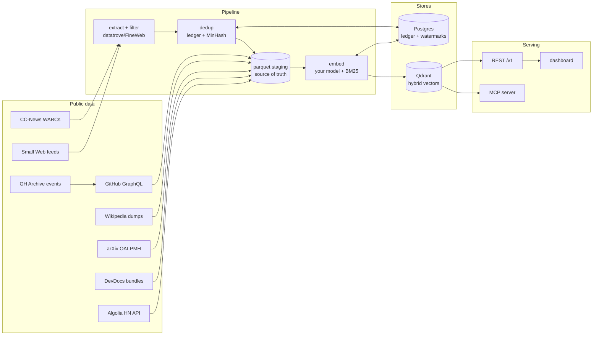

<div align="center">

<picture>
  <source media="(prefers-color-scheme: dark)" srcset="assets/banner-dark.svg">
  <source media="(prefers-color-scheme: light)" srcset="assets/banner-light.svg">
  
</picture>

*Fresh public datasets — CC-News, GitHub, Wikipedia, arXiv, the small web, Hacker News — continuously ingested, deduped, embedded with **your** model, and served as hybrid search over REST and MCP.*


&nbsp;


[Quickstart](#quickstart) · [Architecture](#architecture) · [Search API](#search-api) · [Dashboard](#dashboard) · [Reproducibility](#reproducibility-rebuild-from-any-layer)

</div>

A search index for agents, on your hardware. Everything runs self-hosted; the only external
touchpoints are the public datasets themselves — Common Crawl's news feed, GH Archive and the
GitHub API, Wikimedia's dumps, arXiv's OAI feed, the Algolia HN Search API, and the
small-web blogs it politely polls.

## What it does

- **News** — ingests [CC-News](https://commoncrawl.org/blog/news-dataset-available) WARCs
  daily: extraction and quality filtering built on the
  [datatrove](https://github.com/huggingface/datatrove)/FineWeb production recipe
  (trafilatura extraction, fastText language ID, Gopher/C4/FineWeb filters), then two-tier
  dedup — an exact canonical-URL/content-hash ledger plus MinHash LSH over a rolling window
  to collapse cross-day wire syndication.
- **GitHub projects** — indexes repository metadata and READMEs (not code): candidate
  discovery from GH Archive star events and Search-API sweeps, batched GraphQL hydration,
  README cleaning, and star-aware ranking.
- **Wikipedia** — weekly [CirrusSearch index dumps](https://dumps.wikimedia.org/other/cirrus_search_index/)
  with Wikimedia's own pre-extracted plain text (64 bzip2 shards, `_SUCCESS`-gated); the
  text-hash ledger keeps weekly re-ingests to the changed-article delta instead of
  re-embedding ~7M articles.
- **arXiv** — paper metadata (title + abstract, CC0) over the
  [OAI-PMH](https://oaipmh.arxiv.org/oai) feed: a rate-limited harvest (1 req / 3s)
  chunked into independently restartable per-year date windows, `deletedRecord`
  tombstone handling, and the same text-hash ledger for changed-paper deltas. Full
  text is never harvested. See [`docs/arxiv-source.md`](docs/arxiv-source.md).
- **Small Web** — personal blogs from Kagi's curated
  [smallweb](https://github.com/kagisearch/smallweb) list (MIT; ~38k RSS/Atom feeds,
  one blog per host). windex's first *fetch*-based source: a **polite** poller —
  conditional GET (ETag/304), robots.txt honored per host, a per-host minimum
  interval, a global concurrency cap, and an honest descriptive User-Agent.
  Full-text feeds are indexed straight from the feed body; summary-only items have
  their post page fetched (size/content-type bounded). The quality gate is
  deliberately *lighter* than news — language + length + repetition only, no
  C4/FineWeb — so legitimately short, idiosyncratic blog posts aren't over-rejected.
  windex links out to the blogs (traffic to the small web); it doesn't republish them.
  See [`docs/smallweb-source.md`](docs/smallweb-source.md).
- **Programming docs** — reference documentation for the mainstream stack (Python,
  MDN JavaScript/HTML/CSS, Go, Rust, PostgreSQL, React, Django, …) from
  [DevDocs](https://devdocs.io)' pre-built bundles ([freeCodeCamp/devdocs](https://github.com/freeCodeCamp/devdocs)):
  a 363KB manifest whose per-docset `mtime` is the freshness watermark, then one
  `db.json` of cleaned HTML per docset — no scraping of 20+ documentation sites.
  Search results link to the *official* docs (a per-page scraped-from URL plus a
  maintained canonical-URL table), carry the upstream version, and surface each
  docset's upstream license attribution. Which docsets to index is config
  (`WINDEX_DOCS_SLUGS`). See [`docs/devdocs-source.md`](docs/devdocs-source.md).
- **Hacker News** — stories only, never comments, from the free
  [Algolia HN Search API](https://hn.algolia.com/api) (clean epoch windows via
  `numericFilters`; every query is hard-capped at 1000 hits, so busy windows
  recursively split until they fit), with the
  [open-index/hacker-news](https://huggingface.co/datasets/open-index/hacker-news)
  parquet mirror (ODC-By 1.0) as a zero-API-load backfill accelerator over the
  same month watermarks. One doc per story: the HN discussion page is the
  canonical link, the external target rides along as `target_url`, and points /
  comment counts land under an integer payload index (today's `min_points`
  filter, tomorrow's ranking boost). A trailing re-pull refreshes points *in
  place* — unchanged text is never re-embedded. See
  [`docs/hn-source.md`](docs/hn-source.md).
- **Hugging Face** — the canonical docs for the ML stack (transformers, diffusers,
  peft, trl, timm, smolagents, …) plus 14 courses and the HF blog: ~4,000 pages,
  and *only* those. HF publishes a per-root [`llms.txt`](https://huggingface.co/docs/transformers/llms.txt)
  and serves every doc page as clean **markdown**, so there is no scraping to do —
  and `llms.txt` is the *only* enumeration, since the docs nav is client-rendered.
  Its hash is the freshness watermark: a refresh re-hashes 52 files (~3 min) and
  re-pulls only what changed. Deliberately **excluded** on measured evidence: the
  other ~3.9M pages — Spaces extract to 220 chars (client-rendered mount points),
  dataset pages extract the viewer *table* rather than prose, `/papers/<id>` **is**
  the arXiv id (already indexed here), and model pages can't be enumerated (the
  models sitemap is a rolling 0.2%). windex's second fetch-based source and the
  first pointed at a *single host*, so it self-throttles off HF's own published
  `ratelimit` header (the `pages` bucket: 1 req/3s) instead of reusing Small Web's
  many-hosts config. See [`docs/huggingface-source.md`](docs/huggingface-source.md).
- **Hybrid search** — dense vectors from *your* embedding model (any OpenAI/TEI-compatible
  endpoint, or in-process sentence-transformers) fused with BM25 sparse vectors via RRF in
  [Qdrant](https://qdrant.tech). Semantic queries and exact-name lookups both work.
- **Freshness as a first-class pattern** — every source follows the same loop: a watermark
  table discovers new upstream files, idempotent batch processing catches up, and a daily
  job keeps the index current. Backfill and incremental refresh are the same code.
- **Operations console** — a single-file dashboard with live SSE updates: search UI,
  pipeline stages, per-worker extraction activity, rate charts, a recently-indexed ticker,
  and start/pause/stop controls for every pipeline job.

## Architecture



Postgres holds metadata, dedup ledgers, and freshness watermarks. Extracted text and
embeddings persist to parquet, which makes vectors *derivable*: swapping embedding models or
recovering from index corruption is a re-embed and an alias flip — never a re-crawl.

## Quickstart

Requirements: Python 3.11+, [uv](https://docs.astral.sh/uv/), `libmagic` for WARC
processing (`brew install libmagic` on macOS), a container runtime
(scripts target Apple's `container` CLI; the services are stock `postgres:16` and
`qdrant/qdrant` images), and an embedding endpoint you control.

```sh
scripts/dev.sh up                  # postgres :5432 + qdrant :6333
cp .env.example .env               # set WINDEX_EMBED_* (endpoint, model, dim)
uv sync --all-extras
uv run windex init-db
uv run windex ensure-collections
uv run windex health --embed
uv run windex serve                # dashboard + API on :8100
```

### Ingest news

```sh
uv run windex ccnews sync --days 90     # discover WARCs into the watermark table
uv run windex ccnews run                # download → extract → filter → dedup
uv run windex ccnews embed-loop        # drain the backlog into the index
```

### Ingest GitHub projects

```sh
uv run windex gh sync-hours --start 2024-10-01 --end 2025-10-01   # star-rich archive window
uv run windex gh scan                   # count star events → candidates
uv run windex gh discover               # Search-API sweep for post-2025-10 repos
uv run windex gh hydrate                # metadata + READMEs (needs WINDEX_GITHUB_TOKENS)
uv run windex gh embed
```

> **Why the fixed archive window?** GitHub's 2025-10-07 Events API change removed ~99% of
> star events from the public timeline, so event-based discovery only works against the
> older archive; newer repos are discovered via date-sharded Search API sweeps. See
> `docs/wikipedia-sources.md` for the same verify-against-reality approach applied to the
> next source.

### Ingest Wikipedia

```sh
uv run windex wiki sync      # record the newest complete weekly snapshot (64 shards)
uv run windex wiki ingest    # stream shards → clean parquet + ledger (delta only)
uv run windex wiki embed     # embed staged articles into the wiki collection
```

### Ingest arXiv

```sh
uv run windex arxiv harvest --from-year 2005   # full backfill: per-year OAI windows (~2-3h at 1 req/3s)
uv run windex arxiv harvest --days 7           # incremental: rolling last-N-days window (cron this)
uv run windex arxiv embed                      # embed staged papers into the arxiv collection
```

> **Why per-year windows?** arXiv's OAI resumption tokens expire at the next 00:00
> UTC, so a single 2–3h token chain can't span a day boundary. The backfill is
> chunked into independently restartable per-year windows (`arxiv_windows`
> watermark); the text-hash ledger keeps re-harvests to the changed-paper delta.
> See [`docs/arxiv-source.md`](docs/arxiv-source.md) for the verified source facts.

### Ingest the Small Web

```sh
uv run windex smallweb sync                    # reconcile the feeds table against Kagi's smallweb.txt
uv run windex smallweb poll --max-feeds 1000   # conditional-GET feeds → fetch + stage new posts (polite)
uv run windex smallweb embed                   # embed staged posts into the smallweb collection
```

> **Politeness is the design.** This is windex's only fetch-based source, so the
> poller honors robots.txt per host, throttles to a per-host minimum interval, caps
> global concurrency, sends an honest descriptive User-Agent (a default UA drew 403s
> in sampling), and skips a dead feed after N consecutive failures. Most feeds carry
> full post text inline, so the common case fetches nothing beyond the feed itself.
> The list is MIT-licensed; windex links out to the blogs. See
> [`docs/smallweb-source.md`](docs/smallweb-source.md) for the verified source facts.

### Ingest programming docs

```sh
uv run windex docs sync      # fetch the DevDocs manifest into the docsets watermark
uv run windex docs ingest    # fetch pending docsets → clean parquet + ledger (delta only)
uv run windex docs embed     # embed staged pages into the docs collection
```

> **Why DevDocs bundles?** One manifest + one `db.json` per docset replaces
> scraping 20+ documentation sites, and the manifest's per-docset `mtime` is a
> real freshness watermark (a refresh re-pulls only docsets that changed, and
> the text-hash ledger re-embeds only changed pages; pages that vanish are
> tombstoned). Results still link to the *official* docs: DevDocs records each
> page's scraped-from URL, backed by a maintained canonical-URL table
> (`docs_source/canonical.py`) built from DevDocs' open-source scraper
> definitions. Per-docset upstream licenses (PSF, CC-BY-SA, …) are stored and
> surfaced as attribution in every payload — windex indexes + links out, it
> doesn't republish. See [`docs/devdocs-source.md`](docs/devdocs-source.md).

### Ingest Hacker News

```sh
uv run windex hn backfill              # fast path: monthly parquet mirror, 2006-10 → now (no API load)
uv run windex hn harvest --days 2      # trailing re-pull: new stories + points refresh (cron this)
uv run windex hn embed                 # embed staged stories into the hn collection
```

> **Why a trailing window?** Story text freezes at submission, but points and
> comment counts drift for days. The re-pull skips unchanged stories via the
> text-hash ledger and refreshes their `points`/`num_comments` payloads in
> place (`set_payload`) — score freshness never costs an embedding. Algolia
> caps every query at 1000 hits, so busy windows recursively halve until they
> fit (2026-07-15 had 1,172 stories). Backfill months and the daily tail share
> the same `hn_windows` watermark, so the parquet mirror and the API are
> interchangeable per window. See [`docs/hn-source.md`](docs/hn-source.md).

### Ingest Hugging Face

```sh
uv run windex hf sync     # sitemap → 52 doc roots + 829 blog posts, then re-hash every llms.txt
uv run windex hf crawl    # pull .md for CHANGED roots + new blog posts (~3.3h cold, minutes warm)
uv run windex hf embed    # embed staged pages into the hf collection
```

> **The hash gate is load-bearing, not an optimization.** HF's `pages` rate-limit
> bucket is 1 req/3s (published on every response as
> `ratelimit-policy: "fixed window";"pages";q=100;w=300`), so a naive re-sweep of
> 4,014 pages would cost 3.3 hours *every night* — and a conditional GET wouldn't
> help, because a 304 still spends a request. Instead `hf sync` re-hashes the 52
> `llms.txt` files (~55 requests, ~3 min) and `hf crawl` touches only the roots
> whose hash moved; a quiet day is ~60 requests. The crawler self-throttles off
> the live `ratelimit: "pages";r=98;t=83` counter rather than open-loop sleeping,
> so it stretches automatically when something else has spent the shared per-IP
> budget. Doc pages need no extraction at all (HF serves `text/markdown`); only
> the blog goes through trafilatura. Ids omit the version
> (`hf:docs/transformers/quicktour`) so a version bump upserts rather than forks,
> and link to the unversioned canonical URL the page itself declares. See
> [`docs/huggingface-source.md`](docs/huggingface-source.md).

### Keep it fresh

Every job is idempotent — a rerun is a no-op, a crashed run resumes from its watermark.
`windex daily` covers news + GitHub; the other sources run on their own cadence:

```cron
15 2 * * *  windex daily                                      # news + github tail
30 3 * * *  windex arxiv harvest --days 7 && windex arxiv embed
0  4 * * *  windex smallweb sync && windex smallweb poll && windex smallweb embed
30 4 * * *  windex hn harvest --days 2 && windex hn embed     # trailing window also refreshes points
0  5 * * 0  windex wiki sync && windex wiki ingest && windex wiki embed    # weekly dumps
30 5 * * *  windex docs sync && windex docs ingest && windex docs embed    # devdocs mtime-gated
0  6 * * *  windex hf sync && windex hf crawl && windex hf embed           # llms.txt hash-gated (~60 req on a quiet day)
45 5 * * *  windex maintain                                   # vacuum/analyze churn tables
15 6 * * 0  windex maintain --reindex                         # weekly: rebuild bloat-flagged indexes
```

## Search API

```sh
curl "http://127.0.0.1:8100/v1/search?q=vector+database&source=github&min_stars=100"
curl "http://127.0.0.1:8100/v1/search?q=fed+rate+cut&source=news&published_after=2026-07-01"
curl "http://127.0.0.1:8100/v1/search?q=diffusion+models&source=arxiv&category=cs.LG"
curl "http://127.0.0.1:8100/v1/search?q=vim+config&source=smallweb&outlet=example.com"
curl "http://127.0.0.1:8100/v1/search?q=list+comprehension&source=docs&framework=python"
curl "http://127.0.0.1:8100/v1/search?q=rust+web+framework&source=hn&min_points=50"
curl "http://127.0.0.1:8100/v1/search?q=text+generation+pipeline&source=hf&root=transformers"
curl "http://127.0.0.1:8100/v1/docs/arxiv:2401.00001"     # stored abstract by stable id
curl "http://127.0.0.1:8100/v1/stats"                     # totals + freshness watermarks
```

Responses carry stable ids (`news:<hash>`, `gh:owner/repo`, `wiki:<page_id>`,
`arxiv:<paper_id>`, `smallweb:<hash>`, `docs:<slug>/<path>`, `hn:<item_id>`,
`hf:docs/<root>/<path>` | `hf:blog/<slug>`), snippets, per-source metadata,
and timing breakdowns (`embed_query_ms` / `search_ms`). Under heavy indexing load, hybrid
queries degrade gracefully to keyword search after a deadline rather than stalling — the
response says so explicitly. Full OpenAPI docs at `/docs`.

Agents can also connect over **MCP** (`uv run windex serve-mcp`): tools `search_index` and
`get_document` return the same JSON objects.

## Dashboard

`http://127.0.0.1:8100` — a Search tab and an operations Console: global index totals, live
pipeline stages with per-worker extraction activity, ingest/embed/download rate charts, a
recently-indexed feed, and whitelisted start/stop controls for every pipeline job (typed,
bounded parameters only — the API is LAN-exposed, so nothing free-form ever reaches a
command line). Realtime via SSE.

## Configuration

Everything is environment-driven (`WINDEX_*`, see `.env.example`). The important ones:

| Variable | Purpose |
|---|---|
| `WINDEX_DATA_ROOT` | Bulk storage: downloads, parquet staging (point at a big disk) |
| `WINDEX_EMBED_BACKEND/ENDPOINT/MODEL/DIM` | Your embedding model (`http-openai`, `http-tei`, or `st`) |
| `WINDEX_EMBED_CONCURRENCY/BATCH_SIZE/THROTTLE_SECONDS` | Indexing throughput vs. live-query latency |
| `WINDEX_EMBED_QUERY_TIMEOUT` | Deadline before hybrid search degrades to keyword |
| `WINDEX_GITHUB_TOKENS` | Comma-separated no-scope PATs for hydration |
| `WINDEX_NEWS_BACKFILL_DAYS`, `WINDEX_REPO_STAR_THRESHOLD` | Corpus policy |
| `WINDEX_DOCS_SLUGS` | Which DevDocs docsets to index (comma-separated slugs) |
| `WINDEX_HF_ROOTS` | Which Hugging Face doc roots to index (empty = all 52) |

Model choice is config, not code: collections are named per model and served behind aliases,
so a swap is re-embed from parquet + alias flip.

## Reproducibility: rebuild from any layer

Each layer derives from the one beneath it. The pipeline *is* the recovery procedure.

| Lost / corrupted | Rebuild |
|---|---|
| Vector index | `windex reindex all`, then the embed loops — no re-crawl, no re-extraction |
| Embedding model swap | same operation into a new aliased collection |
| Postgres | restore a dump, or re-run sync + processing (dedup makes re-runs idempotent) |
| arXiv metadata | re-run `windex arxiv harvest` — the per-year windows are restartable and the text-hash ledger dedupes |
| Small Web posts | re-run `windex smallweb poll` — the feeds watermark + text-hash ledger keep re-polls to genuinely new posts |
| Programming docs | re-run `windex docs sync` + `docs ingest` — full-replace per docset; the text-hash ledger keeps it to the changed-page delta |
| Hacker News stories | re-run `windex hn backfill` (parquet mirror) or `hn harvest` (Algolia) — the month windows are restartable and interchangeable between the two; the text-hash ledger dedupes |
| Hugging Face pages | re-run `windex hf sync` + `hf crawl` — the llms.txt hash gate re-pulls only changed roots (an unchanged root costs zero requests); a killed crawl leaves its roots pending |
| Everything | run the ingestion flow from the top |

Battle-tested: an external-drive failure corrupted the vector store mid-backfill; the index
was rebuilt from parquet staging with zero re-crawling.

## Operations

- **Job control** — every pipeline job can be started/stopped from the dashboard's
  Operations cards or the CLI; job logs live under `~/.windex/logs/<job>.log`, viewable
  in the dashboard's Logs panel (level + grep filters).
- **Watchdog** — `nohup scripts/watchdog.sh &` supervises the containers: TCP-path
  health probes, debounced restarts, mount-loss protection for external-drive setups,
  hourly heartbeat in `~/.windex/watchdog.log`.
- **Log rotation** — the server log self-rotates; for belt-and-braces on everything:
  `sudo cp deploy/newsyslog-windex.conf /etc/newsyslog.d/windex.conf` (macOS-native).
- **Pause/throttle** — the dashboard header pauses all indexing between batches; the
  Activity throttle select trades embed throughput against live-search latency at
  runtime (`env` / `polite` / `full`).
- **Store tuning** — applied Postgres/Qdrant settings and their rationale are in
  [`docs/store-tuning.md`](docs/store-tuning.md); schema.sql carries the durable parts.

## Development

```sh
uv run pytest                # unit + live-service integration tests
scripts/dev.sh up|down|psql  # service management
```

Tests run against the live dev Postgres/Qdrant using isolated namespaces and skip cleanly
when services are down. The suite covers the dedup tiers, pipeline orchestration,
outage behavior (fail-fast, circuit breakers), the job whitelist, and the API contract.

## Roadmap

- Cross-encoder reranking, per-passage chunking for long documents
- Additional sources (the pattern generalizes: watermark table + idempotent batches + embed)
