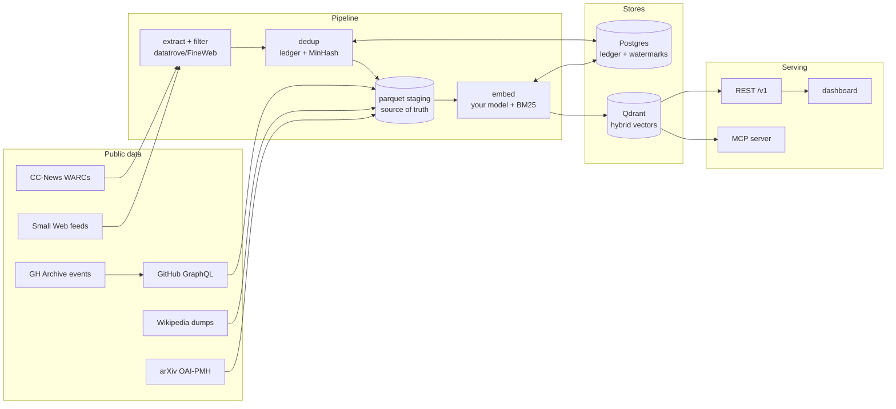

# windex

**A self-hosted web index for search agents.** Fresh news and GitHub projects, continuously
ingested, deduplicated, embedded with your own model, and served over REST and MCP — so your
agents can find things and link to them without ever touching a third-party search API.

Everything runs on your hardware. The only external touchpoints are the public datasets
themselves: Common Crawl's news feed, GH Archive's event stream, and the GitHub API.

## What it does

- **News** — ingests [CC-News](https://commoncrawl.org/blog/news-dataset-available) WARCs
  daily: extraction and quality filtering built on the
  [datatrove](https://github.com/huggingface/datatrove)/FineWeb production recipe
  (trafilatura extraction, fastText language ID, Gopher/C4/FineWeb filters), then two-tier
  dedup — an exact canonical-URL/content-hash ledger plus MinHash LSH over a rolling window
  to collapse cross-day wire syndication.
- **GitHub projects** — indexes repository metadata and READMEs (not code): candidate
  discovery from GH Archive star events and Search-API sweeps, batched GraphQL hydration,
  README cleaning, and star-aware ranking.
- **Wikipedia** — weekly [CirrusSearch index dumps](https://dumps.wikimedia.org/other/cirrus_search_index/)
  with Wikimedia's own pre-extracted plain text (64 bzip2 shards, `_SUCCESS`-gated); the
  text-hash ledger keeps weekly re-ingests to the changed-article delta instead of
  re-embedding ~7M articles.
- **arXiv** — paper metadata (title + abstract, CC0) over the
  [OAI-PMH](https://oaipmh.arxiv.org/oai) feed: a rate-limited harvest (1 req / 3s)
  chunked into independently restartable per-year date windows, `deletedRecord`
  tombstone handling, and the same text-hash ledger for changed-paper deltas. Full
  text is never harvested. See [`docs/arxiv-source.md`](docs/arxiv-source.md).
- **Small Web** — personal blogs from Kagi's curated
  [smallweb](https://github.com/kagisearch/smallweb) list (MIT; ~38k RSS/Atom feeds,
  one blog per host). windex's first *fetch*-based source: a **polite** poller —
  conditional GET (ETag/304), robots.txt honored per host, a per-host minimum
  interval, a global concurrency cap, and an honest descriptive User-Agent.
  Full-text feeds are indexed straight from the feed body; summary-only items have
  their post page fetched (size/content-type bounded). The quality gate is
  deliberately *lighter* than news — language + length + repetition only, no
  C4/FineWeb — so legitimately short, idiosyncratic blog posts aren't over-rejected.
  windex links out to the blogs (traffic to the small web); it doesn't republish them.
  See [`docs/smallweb-source.md`](docs/smallweb-source.md).
- **Hybrid search** — dense vectors from *your* embedding model (any OpenAI/TEI-compatible
  endpoint, or in-process sentence-transformers) fused with BM25 sparse vectors via RRF in
  [Qdrant](https://qdrant.tech). Semantic queries and exact-name lookups both work.
- **Freshness as a first-class pattern** — every source follows the same loop: a watermark
  table discovers new upstream files, idempotent batch processing catches up, and a daily
  job keeps the index current. Backfill and incremental refresh are the same code.
- **Operations console** — a single-file dashboard with live SSE updates: search UI,
  pipeline stages, per-worker extraction activity, rate charts, a recently-indexed ticker,
  and start/pause/stop controls for every pipeline job.

## Architecture



Postgres holds metadata, dedup ledgers, and freshness watermarks. Extracted text and
embeddings persist to parquet, which makes vectors *derivable*: swapping embedding models or
recovering from index corruption is a re-embed and an alias flip — never a re-crawl.

## Quickstart

Requirements: Python 3.11+, [uv](https://docs.astral.sh/uv/), a container runtime
(scripts target Apple's `container` CLI; the services are stock `postgres:16` and
`qdrant/qdrant` images), and an embedding endpoint you control.

```sh
scripts/dev.sh up                  # postgres :5432 + qdrant :6333
cp .env.example .env               # set WINDEX_EMBED_* (endpoint, model, dim)
uv sync --all-extras
uv run windex init-db
uv run windex ensure-collections
uv run windex health --embed
uv run windex serve                # dashboard + API on :8100
```

### Ingest news

```sh
uv run windex ccnews sync --days 90     # discover WARCs into the watermark table
uv run windex ccnews run                # download → extract → filter → dedup
uv run windex ccnews embed-loop        # drain the backlog into the index
```

### Ingest GitHub projects

```sh
uv run windex gh sync-hours --start 2024-10-01 --end 2025-10-01   # star-rich archive window
uv run windex gh scan                   # count star events → candidates
uv run windex gh discover               # Search-API sweep for post-2025-10 repos
uv run windex gh hydrate                # metadata + READMEs (needs WINDEX_GITHUB_TOKENS)
uv run windex gh embed
```

> **Why the fixed archive window?** GitHub's 2025-10-07 Events API change removed ~99% of
> star events from the public timeline, so event-based discovery only works against the
> older archive; newer repos are discovered via date-sharded Search API sweeps. See
> `docs/wikipedia-sources.md` for the same verify-against-reality approach applied to the
> next source.

### Ingest Wikipedia

```sh
uv run windex wiki sync      # record the newest complete weekly snapshot (64 shards)
uv run windex wiki ingest    # stream shards → clean parquet + ledger (delta only)
uv run windex wiki embed     # embed staged articles into the wiki collection
```

### Ingest arXiv

```sh
uv run windex arxiv harvest --from-year 2005   # full backfill: per-year OAI windows (~2-3h at 1 req/3s)
uv run windex arxiv harvest --days 7           # incremental: rolling last-N-days window (cron this)
uv run windex arxiv embed                      # embed staged papers into the arxiv collection
```

> **Why per-year windows?** arXiv's OAI resumption tokens expire at the next 00:00
> UTC, so a single 2–3h token chain can't span a day boundary. The backfill is
> chunked into independently restartable per-year windows (`arxiv_windows`
> watermark); the text-hash ledger keeps re-harvests to the changed-paper delta.
> See [`docs/arxiv-source.md`](docs/arxiv-source.md) for the verified source facts.

### Ingest the Small Web

```sh
uv run windex smallweb sync                    # reconcile the feeds table against Kagi's smallweb.txt
uv run windex smallweb poll --max-feeds 1000   # conditional-GET feeds → fetch + stage new posts (polite)
uv run windex smallweb embed                   # embed staged posts into the smallweb collection
```

> **Politeness is the design.** This is windex's only fetch-based source, so the
> poller honors robots.txt per host, throttles to a per-host minimum interval, caps
> global concurrency, sends an honest descriptive User-Agent (a default UA drew 403s
> in sampling), and skips a dead feed after N consecutive failures. Most feeds carry
> full post text inline, so the common case fetches nothing beyond the feed itself.
> The list is MIT-licensed; windex links out to the blogs. See
> [`docs/smallweb-source.md`](docs/smallweb-source.md) for the verified source facts.

### Keep it fresh

```sh
uv run windex daily                     # idempotent; cron it once a day
```

## Search API

```sh
curl "http://127.0.0.1:8100/v1/search?q=vector+database&source=github&min_stars=100"
curl "http://127.0.0.1:8100/v1/search?q=fed+rate+cut&source=news&published_after=2026-07-01"
curl "http://127.0.0.1:8100/v1/search?q=diffusion+models&source=arxiv&category=cs.LG"
curl "http://127.0.0.1:8100/v1/search?q=vim+config&source=smallweb&outlet=example.com"
curl "http://127.0.0.1:8100/v1/docs/arxiv:2401.00001"     # stored abstract by stable id
curl "http://127.0.0.1:8100/v1/stats"                     # totals + freshness watermarks
```

Responses carry stable ids (`news:<hash>`, `gh:owner/repo`, `wiki:<page_id>`,
`arxiv:<paper_id>`, `smallweb:<hash>`), snippets, per-source metadata,
and timing breakdowns (`embed_query_ms` / `search_ms`). Under heavy indexing load, hybrid
queries degrade gracefully to keyword search after a deadline rather than stalling — the
response says so explicitly. Full OpenAPI docs at `/docs`.

Agents can also connect over **MCP** (`uv run windex serve-mcp`): tools `search_index` and
`get_document` return the same JSON objects.

## Dashboard

`http://127.0.0.1:8100` — a Search tab and an operations Console: global index totals, live
pipeline stages with per-worker extraction activity, ingest/embed/download rate charts, a
recently-indexed feed, and whitelisted start/stop controls for every pipeline job (typed,
bounded parameters only — the API is LAN-exposed, so nothing free-form ever reaches a
command line). Realtime via SSE.

## Configuration

Everything is environment-driven (`WINDEX_*`, see `.env.example`). The important ones:

| Variable | Purpose |
|---|---|
| `WINDEX_DATA_ROOT` | Bulk storage: downloads, parquet staging (point at a big disk) |
| `WINDEX_EMBED_BACKEND/ENDPOINT/MODEL/DIM` | Your embedding model (`http-openai`, `http-tei`, or `st`) |
| `WINDEX_EMBED_CONCURRENCY/BATCH_SIZE/THROTTLE_SECONDS` | Indexing throughput vs. live-query latency |
| `WINDEX_EMBED_QUERY_TIMEOUT` | Deadline before hybrid search degrades to keyword |
| `WINDEX_GITHUB_TOKENS` | Comma-separated no-scope PATs for hydration |
| `WINDEX_NEWS_BACKFILL_DAYS`, `WINDEX_REPO_STAR_THRESHOLD` | Corpus policy |

Model choice is config, not code: collections are named per model and served behind aliases,
so a swap is re-embed from parquet + alias flip.

## Reproducibility: rebuild from any layer

Each layer derives from the one beneath it. The pipeline *is* the recovery procedure.

| Lost / corrupted | Rebuild |
|---|---|
| Vector index | `windex reindex all`, then the embed loops — no re-crawl, no re-extraction |
| Embedding model swap | same operation into a new aliased collection |
| Postgres | restore a dump, or re-run sync + processing (dedup makes re-runs idempotent) |
| arXiv metadata | re-run `windex arxiv harvest` — the per-year windows are restartable and the text-hash ledger dedupes |
| Small Web posts | re-run `windex smallweb poll` — the feeds watermark + text-hash ledger keep re-polls to genuinely new posts |
| Everything | run the ingestion flow from the top |

Battle-tested: an external-drive failure corrupted the vector store mid-backfill; the index
was rebuilt from parquet staging with zero re-crawling.

## Development

```sh
uv run pytest                # unit + live-service integration tests
scripts/dev.sh up|down|psql  # service management
```

Tests run against the live dev Postgres/Qdrant using isolated namespaces and skip cleanly
when services are down. The suite covers the dedup tiers, pipeline orchestration,
outage behavior (fail-fast, circuit breakers), the job whitelist, and the API contract.

## Roadmap

- Cross-encoder reranking, per-passage chunking for long documents
- Additional sources (the pattern generalizes: watermark table + idempotent batches + embed)
