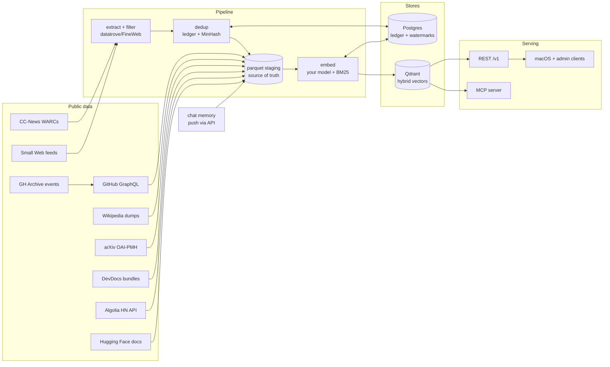

<div align="center">

<picture>
  <source media="(prefers-color-scheme: dark)" srcset="assets/banner-dark.svg">
  <source media="(prefers-color-scheme: light)" srcset="assets/banner-light.svg">
  
</picture>

*Fresh public datasets — CC-News, GitHub, Wikipedia, arXiv, Hacker News, the small web, and developer docs (DevDocs + Hugging Face) — continuously ingested, deduped, embedded with **your** model, and served as hybrid search over REST and MCP.*


&nbsp;


[Quickstart](#quickstart) · [Architecture](#architecture) · [Search API](#search-api) · [Control plane](#control-plane) · [Reproducibility](#reproducibility-and-reset)

</div>

A search index for agents, on your hardware. Everything runs self-hosted; the only external
touchpoints are the public datasets themselves — Common Crawl's news feed, GH Archive and the
GitHub API, Wikimedia's dumps, arXiv's OAI feed, the Algolia HN Search API, the small-web
blogs it politely polls, DevDocs' documentation bundles, and Hugging Face's docs.

## What it does

- **News** — ingests [CC-News](https://commoncrawl.org/blog/news-dataset-available) WARCs
  daily: extraction and quality filtering built on the
  [datatrove](https://github.com/huggingface/datatrove)/FineWeb production recipe
  (trafilatura extraction, fastText language ID, Gopher/C4/FineWeb filters), then two-tier
  dedup — an exact canonical-URL/content-hash ledger plus MinHash LSH over a rolling window
  to collapse cross-day wire syndication.
- **GitHub projects** — indexes repository metadata and READMEs (not code): candidate
  discovery from GH Archive star events and Search-API sweeps, batched GraphQL hydration,
  README cleaning, and star-aware ranking.
- **Wikipedia** — weekly [CirrusSearch index dumps](https://dumps.wikimedia.org/other/cirrus_search_index/)
  with Wikimedia's own pre-extracted plain text (64 bzip2 shards, `_SUCCESS`-gated); the
  text-hash ledger keeps weekly re-ingests to the changed-article delta instead of
  re-embedding ~7M articles.
- **arXiv** — paper metadata (title + abstract, CC0) over the
  [OAI-PMH](https://oaipmh.arxiv.org/oai) feed: a rate-limited harvest (1 req / 3s)
  chunked into independently restartable per-year date windows, `deletedRecord`
  tombstone handling, and the same text-hash ledger for changed-paper deltas. Full
  text is never harvested. See [`docs/arxiv-source.md`](docs/arxiv-source.md).
- **Small Web** — personal blogs from Kagi's curated
  [smallweb](https://github.com/kagisearch/smallweb) list (MIT; ~38k RSS/Atom feeds,
  one blog per host). windex's first *fetch*-based source: a **polite** poller —
  conditional GET (ETag/304), robots.txt honored per host, a per-host minimum
  interval, a global concurrency cap, and an honest descriptive User-Agent.
  Full-text feeds are indexed straight from the feed body; summary-only items have
  their post page fetched (size/content-type bounded). The quality gate is
  deliberately *lighter* than news — language + length + repetition only, no
  C4/FineWeb — so legitimately short, idiosyncratic blog posts aren't over-rejected.
  windex links out to the blogs (traffic to the small web); it doesn't republish them.
  See [`docs/smallweb-source.md`](docs/smallweb-source.md).
- **Programming docs** — reference documentation for the mainstream stack (Python,
  MDN JavaScript/HTML/CSS, Go, Rust, PostgreSQL, React, Django, …) from
  [DevDocs](https://devdocs.io)' pre-built bundles ([freeCodeCamp/devdocs](https://github.com/freeCodeCamp/devdocs)):
  a 363KB manifest whose per-docset `mtime` is the freshness watermark, then one
  `db.json` of cleaned HTML per docset — no scraping of 20+ documentation sites.
  Search results link to the *official* docs (a per-page scraped-from URL plus a
  maintained canonical-URL table), carry the upstream version, and surface each
  docset's upstream license attribution. Which docsets to index is config
  (`WINDEX_DOCS_SLUGS`). See [`docs/devdocs-source.md`](docs/devdocs-source.md).
- **Hacker News** — stories only, never comments, from the free
  [Algolia HN Search API](https://hn.algolia.com/api) (clean epoch windows via
  `numericFilters`; every query is hard-capped at 1000 hits, so busy windows
  recursively split until they fit), with the
  [open-index/hacker-news](https://huggingface.co/datasets/open-index/hacker-news)
  parquet mirror (ODC-By 1.0) as a zero-API-load backfill accelerator over the
  same month watermarks. One doc per story: the HN discussion page is the
  canonical link, the external target rides along as `target_url`, and points /
  comment counts land under an integer payload index (today's `min_points`
  filter, tomorrow's ranking boost). A trailing re-pull refreshes points *in
  place* — unchanged text is never re-embedded. See
  [`docs/hn-source.md`](docs/hn-source.md).
- **Hugging Face** — the canonical docs for the ML stack (transformers, diffusers,
  peft, trl, timm, smolagents, …) plus 14 courses and the HF blog: ~4,000 pages,
  and *only* those. HF publishes a per-root [`llms.txt`](https://huggingface.co/docs/transformers/llms.txt)
  and serves every doc page as clean **markdown**, so there is no scraping to do —
  and `llms.txt` is the *only* enumeration, since the docs nav is client-rendered.
  Its hash is the freshness watermark: a refresh re-hashes 52 files (~3 min) and
  re-pulls only what changed. Deliberately **excluded** on measured evidence: the
  other ~3.9M pages — Spaces extract to 220 chars (client-rendered mount points),
  dataset pages extract the viewer *table* rather than prose, `/papers/<id>` **is**
  the arXiv id (already indexed here), and model pages can't be enumerated (the
  models sitemap is a rolling 0.2%). windex's second fetch-based source and the
  first pointed at a *single host*, so it self-throttles off HF's own published
  `ratelimit` header (the `pages` bucket: 1 req/3s) instead of reusing Small Web's
  many-hosts config. See [`docs/huggingface-source.md`](docs/huggingface-source.md).
- **Chat memory** — the one source not *pulled* from an upstream: it's **pushed**.
  An external app (a chat client) chunks each conversation and `POST`s the whole
  chunk list to `/v1/sources/memory/ingest` with a stable idempotency key.
  The server treats each conversation partition as a complete replacement:
  the Pipeline stages its current chunk set, tombstones vanished chunk IDs, and
  the canonical ledger embeds only changed text. The producer never computes
  embeddings, and it can poll the returned generic Run for completion.
- **Hybrid search** — dense vectors from *your* embedding model (any OpenAI/TEI-compatible
  endpoint, or in-process sentence-transformers) fused with BM25 sparse vectors via RRF in
  [Qdrant](https://qdrant.tech). Semantic queries and exact-name lookups both work.
- **Freshness as a first-class pattern** — every source follows the same loop: a watermark
  table discovers new upstream files, idempotent batch processing catches up, and a daily
  job keeps the index current. Backfill and incremental refresh are the same code.
- **Canonical control plane** — immutable Pipeline revisions, pinned Sources,
  generic Runs, validated cron/interval/event triggers, exact-revision layouts,
  and cursor-based operational events over authenticated `/admin/v1` APIs.

## Architecture


```mermaid
flowchart LR
    subgraph sources [Public data]
        CC[CC-News WARCs]
        GHA[GH Archive events]
        GH[GitHub GraphQL]
        WK[Wikipedia dumps]
        AX[arXiv OAI-PMH]
        SW[Small Web feeds]
        DV[DevDocs bundles]
        HN[Algolia HN API]
        HF[Hugging Face docs]
    end
    MEM[chat memory<br/>push via API]
    subgraph pipeline [Pipeline]
        EX[extract + filter<br/>datatrove/FineWeb]
        DD[dedup<br/>ledger + MinHash]
        PQ[(parquet staging<br/>source of truth)]
        EM[embed<br/>your model + BM25]
    end
    subgraph stores [Stores]
        PG[(Postgres<br/>ledger + watermarks)]
        QD[(Qdrant<br/>hybrid vectors)]
    end
    subgraph serving [Serving]
        API[REST /v1]
        MCP[MCP server]
        ADMIN[macOS + admin clients]
    end
    CC --> EX --> DD --> PQ --> EM --> QD
    GHA --> GH --> PQ
    WK --> PQ
    AX --> PQ
    SW --> EX
    DV --> PQ
    HN --> PQ
    HF --> PQ
    MEM --> PQ
    DD <--> PG
    EM <--> PG
    QD --> API --> ADMIN
    QD --> MCP
```

Postgres holds metadata, dedup ledgers, and freshness watermarks. Extracted text and
embeddings persist to parquet, which makes vectors *derivable*: swapping embedding models or
recovering from index corruption is a re-embed and an alias flip — never a re-crawl.

## Quickstart

Production is the Linux/rootless-Podman stack in [`compose.yaml`](compose.yaml).
It runs Postgres, Qdrant, the API, one Source scheduler, one leased Pipeline
worker pool, and the isolated local-Module sandbox. An OpenAI- or
TEI-compatible embedding endpoint is supplied separately.

Requirements: Python 3.12, [uv](https://docs.astral.sh/uv/), Podman,
`podman-compose`, and an embedding endpoint.

```sh
cp .env.example .env
# Set WINDEX_EMBED_ENDPOINT, WINDEX_EMBED_MODEL, WINDEX_EMBED_DIM,
# WINDEX_WRITE_TOKEN, and the two data roots in .env.

podman-compose -p windex -f compose.yaml build
podman-compose -p windex -f compose.yaml up -d postgres qdrant
podman-compose -p windex -f compose.yaml run --rm windex-serve init-db
podman-compose -p windex -f compose.yaml up -d

curl -fsS http://127.0.0.1:8100/admin/v1/health
podman-compose -p windex -f compose.yaml ps
```

`init-db` is additive and idempotent for an epoch-2 database. It creates schema
additions and publishes changed built-in Pipeline revisions, but it deliberately
does not move existing Sources to those revisions. See
[`docs/operations.md`](docs/operations.md) for the required preview/upgrade step
after a Module implementation changes.

### Run and schedule Sources

Pull ingestion is now expressed as immutable Pipeline revisions and Source
Runs. There are no per-Source command families or embedding processes. To start
one bounded Flow:

```sh
B=http://127.0.0.1:8100
TOKEN="${WINDEX_WRITE_TOKEN:?export WINDEX_WRITE_TOKEN first}"

curl -fsS -X POST "$B/admin/v1/sources/ccnews/runs" \
  -H "Authorization: Bearer $TOKEN" \
  -H 'Content-Type: application/json' \
  -d '{"flow":"sync"}'
```

The response is HTTP 202 with a `run_id`. Follow it at
`GET /admin/v1/runs/{run_id}`; the worker adds the searchable `platform.index`
continuation automatically. Queue the next Flow only after its prerequisite
Run succeeds—for example `ccnews: sync → ingest`, `wiki: sync → ingest`,
`docs: sync → ingest`, `smallweb: sync → poll`, `hf: sync → crawl`, and
`gh: discover → hydrate → compose`. arXiv and HN each expose `harvest`.

Recurring work belongs to Source triggers:

```sh
curl -fsS -X POST "$B/admin/v1/sources/hn/triggers" \
  -H "Authorization: Bearer $TOKEN" \
  -H 'Content-Type: application/json' \
  -d '{"flow_name":"harvest","trigger_type":"cron",
       "trigger_spec":{"cron":"30 4 * * *","timezone":"America/Los_Angeles"}}'
```

The trigger API validates `cron`, `interval`, `event`, and `manual` bindings.
The scheduler dispatches cron, interval, and event bindings; manual bindings
have no automatic deadline. Event triggers consume the durable operational
journal exactly once per trigger cursor, start at the journal tail when created
or edited, and limit event-triggered causality to one hop.

### Push documents

Push Sources use the canonical data endpoint:

```text
POST /v1/sources/{name}/ingest
```

Every request has a stable 8–128 character `Idempotency-Key`, returns HTTP 202,
and must be monitored as a Run if completion matters. The built-in `memory`
Source uses full, partition-scoped replacement; reusable custom Sources use
delta upserts and explicit tombstone documents. See
[`docs/memory-ingest-contract.md`](docs/memory-ingest-contract.md) and
[`docs/custom-sources.md`](docs/custom-sources.md).

## Search API

```sh
curl "http://127.0.0.1:8100/v1/search?q=vector+database&source=github&min_stars=100"
curl "http://127.0.0.1:8100/v1/search?q=fed+rate+cut&source=news&published_after=2026-07-01"
curl "http://127.0.0.1:8100/v1/search?q=diffusion+models&source=arxiv&category=cs.LG"
curl "http://127.0.0.1:8100/v1/search?q=vim+config&source=smallweb&outlet=example.com"
curl "http://127.0.0.1:8100/v1/search?q=list+comprehension&source=docs&framework=python"
curl "http://127.0.0.1:8100/v1/search?q=rust+web+framework&source=hn&min_points=50"
curl "http://127.0.0.1:8100/v1/search?q=text+generation+pipeline&source=hf&root=transformers"
curl "http://127.0.0.1:8100/v1/docs/arxiv:2401.00001"     # stored abstract by stable id
```

Responses carry stable ids (`news:<hash>`, `gh:owner/repo`, `wiki:<page_id>`,
`arxiv:<paper_id>`, `smallweb:<hash>`, `docs:<slug>/<path>`, `hn:<item_id>`,
`hf:docs/<root>/<path>` | `hf:blog/<slug>`), snippets, per-source metadata,
and timing breakdowns (`embed_query_ms` / `search_ms`). Under heavy indexing load, hybrid
queries degrade gracefully to keyword search after a deadline rather than stalling — the
response says so explicitly. Full OpenAPI docs at `/docs`.

Agents can also connect over **MCP** (`uv run windex serve-mcp`): tools `search_index` and
`get_document` return the same JSON objects.

## Control plane

The native macOS client is the interactive Pipeline, Source, Run, Overview, and
Console surface. Headless operators use the authenticated `/admin/v1` API. Both
consume the same immutable revisions, exact-revision layouts, generic Runs, and
cursor-based event streams. This backend does not expose the removed browser
operations console or legacy job-control routes.

Pairing starts with `GET /admin/v1/health`. A compatible server always returns
HTTP 200 and `contract_epoch: 2`; dependency state is reported separately in
the additive `readiness` object. Temporary degradation must not be interpreted
as a contract mismatch.

## Configuration

Everything is environment-driven (`WINDEX_*`, see `.env.example`). The important ones:

| Variable | Purpose |
|---|---|
| `WINDEX_DATA_ROOT` | Bulk storage: downloads, parquet staging (point at a big disk) |
| `WINDEX_PIPELINE_GC_*` | Terminal-Run retention, file-age grace, cadence, and per-pass cleanup budgets |
| `WINDEX_EMBED_BACKEND/ENDPOINT/MODEL/DIM` | Your embedding model (`http-openai`, `http-tei`, or `st`) |
| `WINDEX_EMBED_CONCURRENCY/BATCH_SIZE/THROTTLE_SECONDS` | Indexing throughput vs. live-query latency |
| `WINDEX_EMBED_QUERY_TIMEOUT` | Deadline before hybrid search degrades to keyword |
| `WINDEX_GITHUB_TOKENS` | Comma-separated no-scope PATs for hydration |
| `WINDEX_NEWS_BACKFILL_DAYS`, `WINDEX_REPO_STAR_THRESHOLD` | Corpus policy |
| `WINDEX_DOCS_SLUGS` | Which DevDocs docsets to index (comma-separated slugs) |
| `WINDEX_HF_ROOTS` | Which Hugging Face doc roots to index (empty = all 52) |

Model choice is config, not code: collections are named per model and served behind aliases,
so a swap is re-embed from parquet + alias flip.

## Reproducibility and reset

Every Run freezes its Pipeline revision, Module locks, Source binding, effective
parameters, and inputs. Pulled Sources retain durable watermark units; pushed
Sources retain document identity in the canonical ledger. Re-running an
unchanged unit is therefore idempotent, while metadata-only changes refresh the
Qdrant payload without paying for another embedding.

A Source reset is a confirmation-gated generation change:

1. `POST /admin/v1/sources/{name}/reset/preview`
2. review its document, state-unit, and outstanding-task counts;
3. `POST /admin/v1/sources/{name}/reset` with the returned
   `confirmation_token`; and
4. queue the Source's ingestion Flows again.

Do not delete Postgres tables, Qdrant collections, or staging paths by hand.
The one-time destructive migration from a pre-epoch-2 database is a separate,
fail-closed procedure in
[`docs/source-pipeline-cutover-runbook.md`](docs/source-pipeline-cutover-runbook.md).

## Operations

- **Lifecycle and logs** — use `podman-compose ... ps`, `logs`, `stop`, and
  `up -d`; application source is baked into the image, so code changes require
  a rebuild and container recreation.
- **Health** — `GET /admin/v1/health` reports compatibility and component
  readiness; `uv run windex health --embed` is the host-side diagnostic.
- **Metrics** — `GET /metrics` exports canonical Source/Run/task state,
  dependency probes, search RED metrics, and DB-aware storage-GC results.
  Checked-in Prometheus, Grafana, and alert configuration lives in
  [`ops/`](ops/).
- **Retention** — the Source scheduler performs bounded hourly cleanup of
  unreferenced files owned by old terminal Runs. It never treats a filesystem
  walk alone as proof that a file is disposable.
- **Deployments** — `init-db` must run before the new scheduler/workers. If
  implementation digests changed, inspect `/admin/v1/module-health` and
  explicitly preview/upgrade affected Sources before accepting new Runs.

The complete production procedure and incident commands are in
[`docs/operations.md`](docs/operations.md).

## Development

```sh
podman-compose -p windex -f compose.yaml up -d postgres qdrant
uv sync --all-extras
uv run pytest
uv run ruff check src tests
uv run python scripts/dump-openapi.py --check
uv run python scripts/dump-openapi.py --which admin --check
```

Tests run against the live dev Postgres/Qdrant using isolated namespaces and skip cleanly
when services are down. The suite covers the dedup tiers, pipeline orchestration,
leased worker behavior, trigger dispatch, outage behavior, and both OpenAPI contracts.

## Roadmap

- Cross-encoder reranking, per-passage chunking for long documents
- Additional sources (the pattern generalizes: watermark table + idempotent batches + embed)
